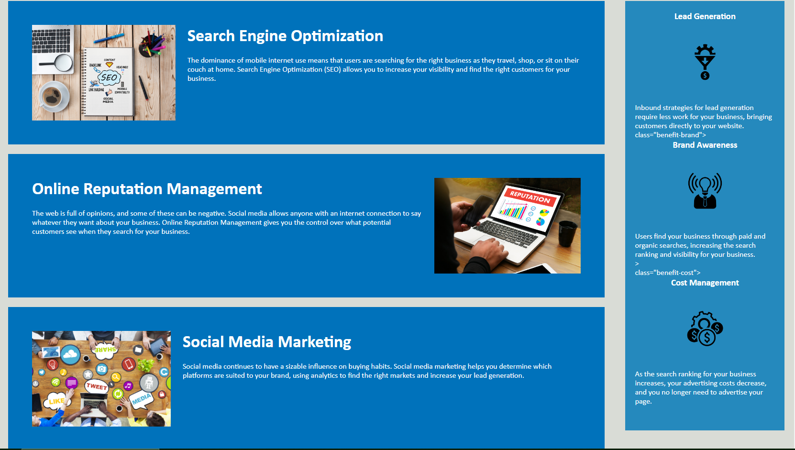

# Horiseon Social Solution Services Demo

## Description

This challenge was provided with starter code with the goal to ensure that the code contained semantic elements which allows for accessibility for the end user. Furthermore the idea was to clean and order the code without altering any of the existing layouts. Now on my part the code has been updated to include semantic elememts rather than having numourous div elements throughout the project. These were replaced with the neccessary elements to organize the code according to each line of code's purpose. Each header element was also revised to ensure that the HTML index file read in sequential order from top to bottom beginning with the h1 element and following the order down to the last h4 element. The title element was also altered to include the name of the company in which we are doing the mock-up for to add a layer of professionalism to the appearance of the webpage. Each element was also revised to ensure that there is proper nesting and indenting of each element within its parent. Lastly for the CSS file I consolidated each class that was causing unnecessary lines of code into one single function as long as they shared exactly similar styling. Attched is a link to the [Deployed Github Webpage](https://ignaciog08.github.io/Horiseon-Social-Solution-Services-Demo/) .

## Visuals

## Installation

N/A

## Usage

This project can be utilized by any individual to get a idea of a project that was introduced with starter code and altered to practice coding. It is a excellent project to understand the elements that go into coding before having to create your own pages from scratch.

## Credits

N/A

## License

N/A
